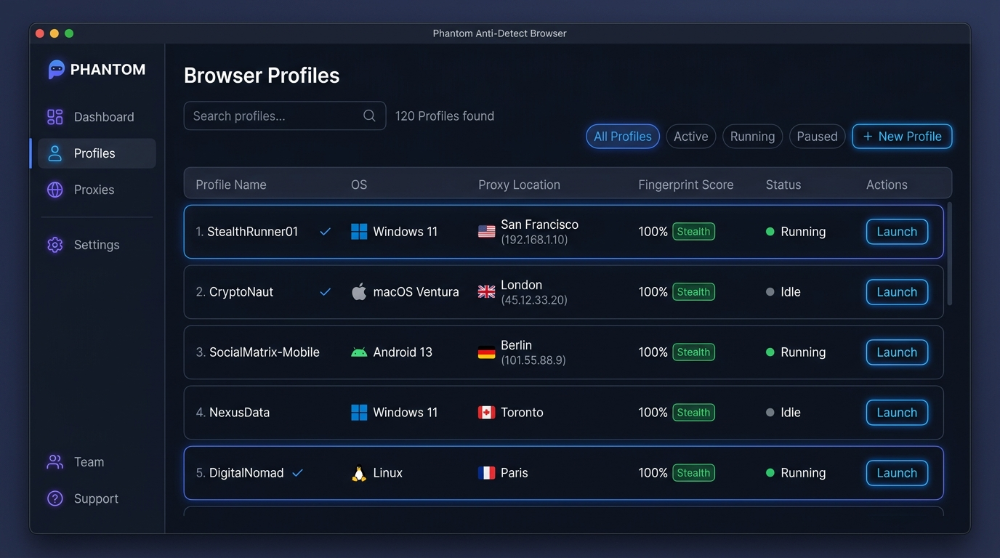
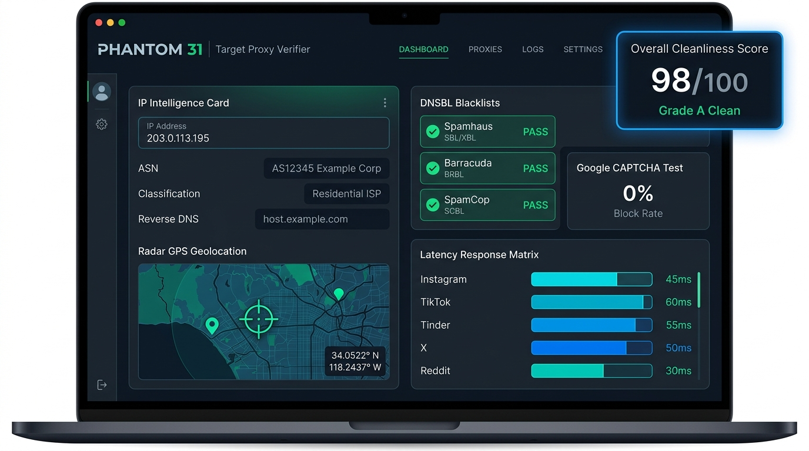
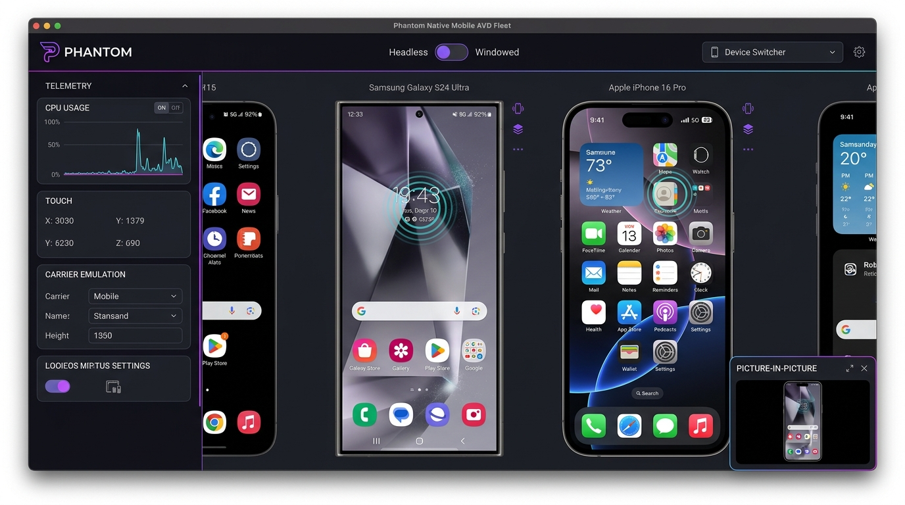
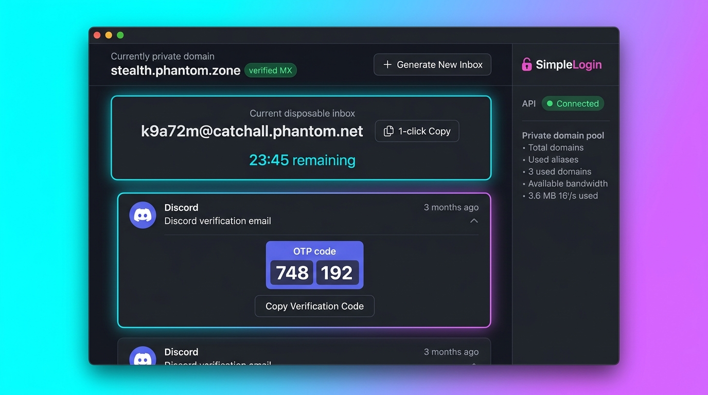
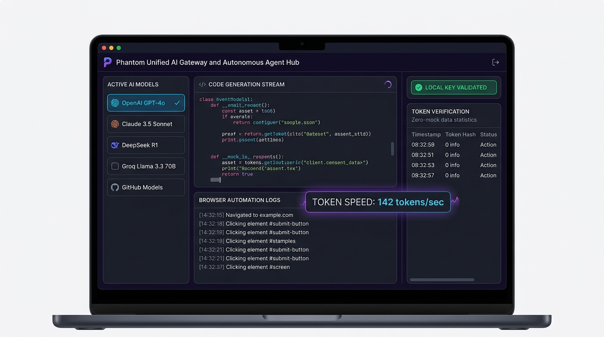
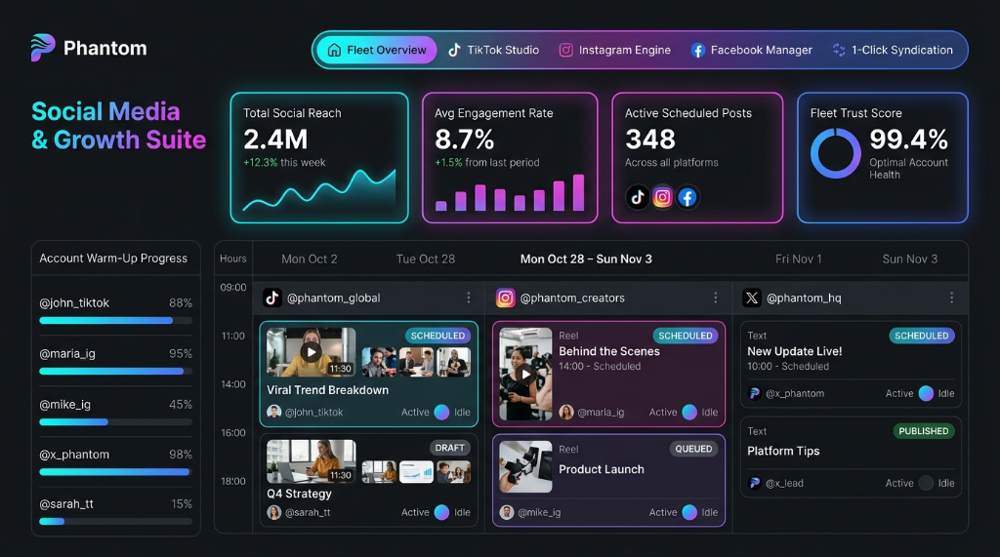

# 👻 Phantom Browser & Automation Studio

### The World's First AI-Native Anti-Detect Browser & Multi-Platform Automation OS

[-blue?style=for-the-badge&logo=windows)](https://github.com/phantom-stealth/phantom-desktop/releases/latest)

---

### [🌐 Visit Official Website & Pricing Portal (https://phantom-stealth.github.io/phantom-desktop/)](https://phantom-stealth.github.io/phantom-desktop/)

---

## ⚡ Direct Downloads (Latest v1.0.0)

| Package | Format | Architecture | Download Link | Verification |
|---|---|---|---|---|
| **Windows Setup (Recommended)** | NSIS Installer (`.exe`) | x64 | [📥 Download Setup v1.0.0](https://github.com/phantom-stealth/phantom-desktop/releases/download/v1.0.0/Phantom-Setup-1.0.0.exe) | SHA-512 Blockmap Verified |
| **Windows Portable** | Standalone Binary (`.exe`) | x64 | [📥 Download Portable v1.0.0](https://github.com/phantom-stealth/phantom-desktop/releases/download/v1.0.0/Phantom-1.0.0.exe) | Zero-Installation Required |
| **All Releases & Notes** | GitHub Release Hub | — | [📋 View All Releases](https://github.com/phantom-stealth/phantom-desktop/releases) | Full Changelog & Assets |

---

## 📸 Product Showcases & Screenshots

| Browser Profile Management | 31-Target Proxy Verifier & GPS Radar |
| :---: | :---: |
|  |  |

| Native Mobile AVD Fleet (with PiP Dock) | Temp Email & SimpleLogin OTP Hub |
| :---: | :---: |
|  |  |

| Unified Multi-Model AI Gateway | Social Media & Growth Suite |
| :---: | :---: |
|  |  |

---

## 💎 Transparent Pricing Plans

| Plan | Monthly | Annual (Save 20%) | Profiles | Team Seats | Key Highlights |
|---|---|---|---|---|---|
| **Community** | **$0** /mo | **$0** /forever | 10 | 1 | Full W3C Prototype Stealth, 10 Proxy Scans/day, Temp Email, GitHub Auto-Updates |
| **Solo Pro** | **$19** /mo | **$15** /mo | 50 | 3 | Unlimited 31-Target Proxy Verifier, SimpleLogin REST API, 3 Mobile AVDs |
| **Agency Team** *(Popular)* | **$49** /mo | **$39** /mo | 200 | 10 | Custom Private Domains, 8 Mobile AVDs with PiP, Social Repurposing Hub |
| **Scale Enterprise** | **$99** /mo | **$79** /mo | Unlimited | Unlimited | Dedicated Cloud Sync, 20+ Mobile AVDs, Custom Hardware Profiles, 24/7 VIP Support |

---

## 🚀 Key Architectural Capabilities

### 🛡️ W3C Prototype Anti-Detect Engine
- **Zero-Prototype-Leak Architecture:** Property overrides defined strictly on `Navigator.prototype`, `Screen.prototype`, and `PluginArray.prototype` with genuine native code signatures.
- **Authentic PCI Device IDs:** Hardware spoofing with real Direct3D11 / ANGLE PCI strings (NVIDIA RTX 4070/4090/3060, Intel Iris Xe) matching authentic driver profiles.
- **Client Hints & User-Agent Synchronization:** Strict consistency between HTTP `Sec-CH-UA` headers, `navigator.userAgentData`, and platform descriptors.
- **Standardized W3C Battery & Network APIs:** Battery status strictly adheres to W3C Level 2 specs; network downlink capped to genuine physical limits (`<= 10 Mbps`).

### 🌐 31-Target Proxy Cleanliness Verifier
- **Multi-DNSBL Reputation Engine:** Live check against Spamhaus ZEN, SORBS, SpamCop, Barracuda, and DroneBL via IPv4 reverse octet DNS resolution.
- **Search & Anti-Bot Defense Probing:** Live verification against Google Search CAPTCHA, Cloudflare Turnstile/WAF, Bing, DuckDuckGo, Akamai Bot Manager, and DataDome.
- **13 Social Platforms:** Cleanliness matrix for Instagram, TikTok, X (Twitter), Facebook, Threads, Reddit, LinkedIn, YouTube, Discord, Snapchat, Pinterest, Twitch, Telegram Web.
- **16 Dating Sites & Abuse Scorer:** Strict datacenter/bot-farm detection and prior usage tracking across Tinder, Bumble, Hinge, Badoo, OkCupid, Match, POF, eHarmony, Zoosk, and Feeld.
- **Interactive OpenStreetMap GPS Radar:** Pinpoint coordinates, latitude/longitude, and ISP gateway accuracy radius estimation.

### 📱 Dual Mobile Simulation Fleet
- **Native Android Virtual Devices (AVD):** Integrated Pixel 8 Pro, Galaxy S24 Ultra, OnePlus 12, and Xiaomi 14 AVD management with live screen mirroring, touch input forwarding, and headed/headless toggles.
- **Floating Picture-in-Picture Mini Dock:** Minimize active mobile phone screens into a 240px x 420px floating dock to monitor mobile actions while navigating other menus.
- **iOS WebKit Privacy Stealth:** Emulation of iPhone 16 Pro / iPad Pro with total eradication of Chromium-specific globals (`window.chrome`, `navigator.userAgentData`, `deviceMemory`).

### 📧 Temp Email & SimpleLogin Integration
- **Private Domain Catch-All:** Multi-domain pool supporting custom catchall domains, Cloudflare Email Routing, and direct webhooks.
- **SimpleLogin REST API:** 1-click alias creation with auto-expiring inboxes and automated multi-platform OTP / verification code extraction (Discord, Tinder, X, Steam, Google).

### 🧩 Chrome Extension Ecosystem
- **Chrome Web Store Quick-Install:** Direct installation of extensions from Chrome Web Store with auto-enabling patches and local CRX archive unpacker.

### 🧠 Unified AI Gateway
- Multi-provider model router supporting OpenAI (GPT-4o), Anthropic (Claude 3.5), Google Gemini, DeepSeek (V3/R1), Meta Llama 3.3, and LM Arena blind testing with local zero-mock key sink.

---

## 🔄 Seamless Auto-Updates

Phantom includes built-in differential background updates powered by `electron-updater`:
- Automatically checks for updates every 4 hours against the official release manifest (`latest.yml`).
- Downloads only changed binary chunks via `.blockmap` differential technology (saving 90%+ bandwidth).
- Prompts for instant 1-click restart or updates automatically on next application launch.

---

## 🔒 Security & Verification

Every release is signed and packaged with cryptographic hashes:
- **Manifest:** [`latest.yml`](https://github.com/phantom-stealth/phantom-desktop/releases/latest/download/latest.yml)
- **Differential Map:** [`Phantom Setup 1.0.0.exe.blockmap`](https://github.com/phantom-stealth/phantom-desktop/releases/latest/download/Phantom-Setup-1.0.0.exe.blockmap)
- **SHA-512:** `qXlz4bGv/CFV7xrH6h1wW5+2DJVS6fkEoNpcWwDi+OIymdiic5oa6mNoQM9v8rvH97qQoYymlqRNyvZiEmHMLQ==`

To report an issue or suggest a feature, please open an issue on the [Issue Tracker](https://github.com/phantom-stealth/phantom-desktop/issues).

---

  © 2026 Phantom Stealth. All rights reserved.

